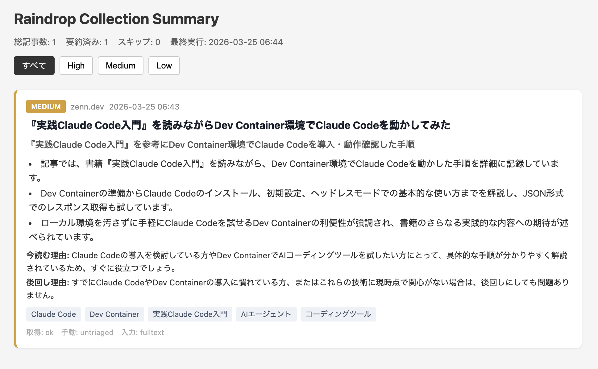

# Tsuyu-mi
[日本語](README_ja.md)

[](https://www.python.org/)
[](LICENSE)
[](https://github.com/unsolublesugar/tsuyu-mi/actions)<br>




Periodically fetches articles from a Raindrop.io collection, extracts their content, summarizes them with AI, and outputs a priority-ranked HTML dashboard.

> The name **Tsuyu-mi** comes from: Raindrop &rarr; *shizuku* (雫, droplet) &rarr; *tsuyu* (露, dew) &rarr; *tsuyu-mi* (露見, "seeing the dew").

## Purpose

Triage your "read later" articles saved in Raindrop — before reading the full text.

- **Read now** — timely or high-value
- **Defer** — interesting but not urgent
- **Drop** — safe to discard

## Setup

### 1. Clone the repository

```bash
git clone https://github.com/unsolublesugar/tsuyu-mi.git
cd tsuyu-mi
```

### 2. Prepare the Python environment

> [!NOTE]
> Python 3.11 or later is required. [uv](https://docs.astral.sh/uv/) can install Python itself alongside dependencies.

```bash
# Using uv (recommended)
uv venv --python 3.11
source .venv/bin/activate
uv pip install -e ".[dev]"

# Using pip
python -m venv .venv
source .venv/bin/activate
pip install -e ".[dev]"
```

### 3. Obtain API keys

This tool requires a **Raindrop.io API token** and an **LLM API key**.

#### Raindrop.io test token

1. Go to [Raindrop.io Integrations](https://app.raindrop.io/settings/integrations)
2. Click **Create new app** under "For Developers"
3. Enter an app name (e.g. `RaindropSummarizer`) and create it
4. Click the app → **Create test token**
5. Copy the displayed token

#### Collection ID

1. Open [Raindrop.io](https://app.raindrop.io)
2. Navigate to the target collection (e.g. "Unsorted")
3. Check the URL: `https://app.raindrop.io/my/{collection_id}` — the numeric part is the collection ID

#### LLM API key

Obtain an API key from one of the following providers:

**Google Gemini (recommended — has a free tier)**

1. Go to [Google AI Studio](https://aistudio.google.com/apikey)
2. **Create API Key** → **Create API key in new project**
3. Recommended model: `gemini-2.5-flash`

> [!TIP]
> You may need to link a Google Cloud billing account and [enable the Gemini API](https://console.cloud.google.com/apis/library/generativelanguage.googleapis.com).

**OpenAI**

1. Go to [OpenAI API Keys](https://platform.openai.com/api-keys)
2. **Create new secret key**
3. Recommended model: `gpt-4.1-mini`

**Anthropic**

1. Go to [Anthropic Console](https://console.anthropic.com/settings/keys)
2. **Create Key**
3. Recommended model: `claude-haiku-4-5-20251001`

### 4. Configure environment variables

#### Local execution

```bash
cp .env.example .env
```

Edit `.env` with your keys:

```env
RAINDROP_TOKEN=your-raindrop-token
RAINDROP_COLLECTION_ID=your-collection-id
LLM_PROVIDER=gemini
LLM_API_KEY=your-llm-api-key
LLM_MODEL=gemini-2.5-flash
```

> [!WARNING]
> Never commit `.env` to the repository — it contains secrets.

#### GitHub Actions

Add the following to your repository: Settings → Secrets and variables → Actions → Repository secrets.

| Secret name | Value |
|---|---|
| `RAINDROP_TOKEN` | Raindrop.io API test token |
| `RAINDROP_COLLECTION_ID` | Target collection ID |
| `LLM_PROVIDER` | `gemini` / `openai` / `anthropic` |
| `LLM_API_KEY` | LLM API key |
| `LLM_MODEL` | Model name (e.g. `gemini-2.5-flash`) |

### 5. Verify

```bash
# Test Raindrop API connectivity only (no LLM required)
python -m src fetch-only

# Summarize a small batch
MAX_SUMMARIZE_PER_RUN=3 python -m src run

# Full run
python -m src run
```

## Usage

```bash
# Full pipeline (fetch → extract → summarize → generate HTML)
python -m src run

# Dry run — preview target articles without processing
python -m src run --dry-run

# Verbose logging
python -m src run --verbose

# Fetch from Raindrop only
python -m src fetch-only

# Regenerate HTML
python -m src build-html

# Reprocess a specific article
python -m src reprocess --id 123456789

# Retry all failed articles
python -m src reprocess-failed
```

## Output

An article dashboard is generated at `docs/index.html`. Open it in a browser to review.

- Color-coded by priority (HIGH = red / MEDIUM = yellow / LOW = gray)
- Filter buttons to narrow by priority
- Each article shows a 3-line summary, read-now reason, defer reason, and keywords

## Configuration

| Environment variable | Description | Default |
|---|---|---|
| `RAINDROP_TOKEN` | Raindrop.io API test token | (required) |
| `RAINDROP_COLLECTION_ID` | Target collection ID | (required) |
| `LLM_PROVIDER` | `openai` / `gemini` / `anthropic` | `openai` |
| `LLM_API_KEY` | LLM API key | (required) |
| `LLM_MODEL` | Model name | (required) |
| `MAX_SUMMARIZE_PER_RUN` | Max articles to summarize per run | `10` |
| `REQUEST_TIMEOUT_SECONDS` | HTTP request timeout (seconds) | `20` |
| `USER_AGENT` | HTTP User-Agent header | `Tsuyu-mi/0.1` |
| `OUTPUT_DIR` | HTML output directory | `docs` |
| `DATA_DIR` | Data storage directory | `data` |
| `STATE_DIR` | State management directory | `state` |
| `LOG_LEVEL` | Log level | `INFO` |

## Automated operation with GitHub Actions

### 1. Set up GitHub Secrets

See "4. Configure environment variables → GitHub Actions" above.

### 2. Enable GitHub Pages

Settings → Pages → Source: **GitHub Actions**

> [!IMPORTANT]
> Private repositories require **GitHub Pro** or higher to use GitHub Pages.

### 3. Execution schedule

- **Automatic**: Every 3 days at JST 7:00 (UTC 22:00)
- **Manual**: Run on demand from the Actions tab via "Run workflow"

Changes are auto-committed and pushed only when new content is generated.

## Testing

```bash
pytest
```

## License

[MIT](LICENSE)
